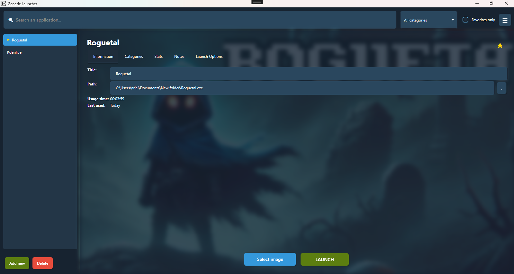
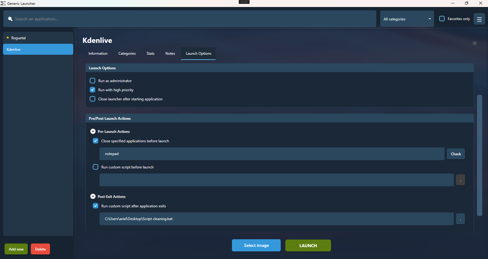

# Generic Launcher

<h2 align="center">Screenshots</h2>

## Description

Generic Launcher is a desktop application developed in WPF (.NET) that allows you to organize, manage, and launch your games and applications from a unified interface. Designed to improve your user experience when accessing your favorite programs, this tool features advanced customization and usage tracking capabilities.

## System Requirements

- Windows 10 or higher
- .NET 10.0 or higher
- Minimum recommended screen resolution: 1280x720

## Installation

1. Download the latest version from the releases section
2. Extract the ZIP file to the desired location
3. Run `GenericLauncher.exe`
4. Start adding your favorite applications!

## Usage Guide

### Adding Applications

#### Manual Method
1. Click the "Add new" button located at the bottom left
2. Fill in the basic information:
   - **Title**: Name to identify the application
   - **Path**: Path to the executable (you can use the "..." button to navigate)
3. Optionally, select an image for the application by clicking "Select image"
4. Configure launch options according to your preferences
5. Add the application to categories for better organization

#### Auto-Detect Applications
1. Click the menu button (☰) in the top bar
2. Select "Auto-Detect Applications"
3. Wait for the scan to complete
4. Review detected applications grouped by category
5. Select which applications to import
6. Click "Import Selected"

#### Import from Game Launchers
1. Click the menu button (☰) in the top bar
2. Select "Import from Game Launchers"
3. The app will scan for Steam, Epic Games, and GOG Galaxy. <strong>Some online games may not be able to be opened with the launcher due to anti-cheat systems.</strong>
4. Review detected games grouped by launcher
5. Select which games to import
6. Click "Import Selected"
7. Games will be automatically categorized by their launcher

### Launching an Application

1. Select the desired application from the list
2. Click the "LAUNCH" button at the bottom of the details window
3. If you have configured the "Close launcher after starting application" option, the launcher will close automatically

### Organizing by Categories

1. Select an application from the list
2. Go to the "Categories" tab
3. Enter a name for the new category and click "Add category"
4. To filter by category, use the dropdown menu in the top bar

### Advanced Actions

#### Configuring Pre-launch/Post-close Scripts

1. Select an application
2. Go to the "Launch Options" tab
3. Expand the "Pre/Post Launch Actions" section
4. Enable the desired options and configure the paths to the scripts

#### Exporting/Importing Library

1. Click the menu button (☰) in the top right corner
2. Select "Export Library" or "Import Library"
3. Follow the on-screen instructions to complete the operation

## License

Generic Launcher is open-source software under the [MIT](LICENSE) license.
